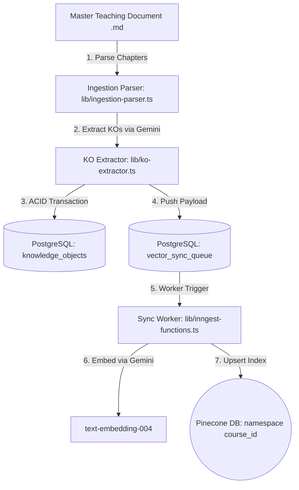
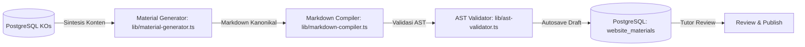
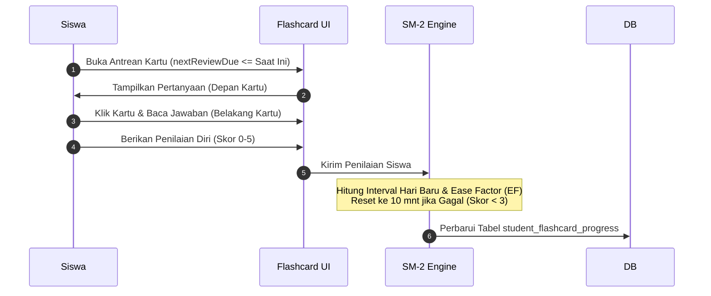
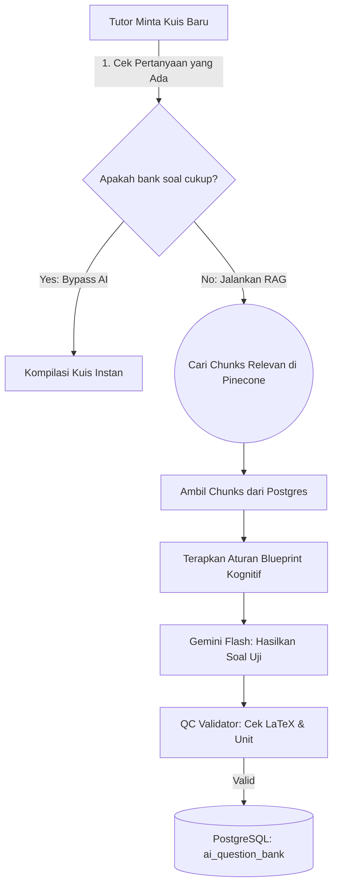
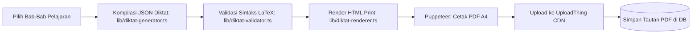
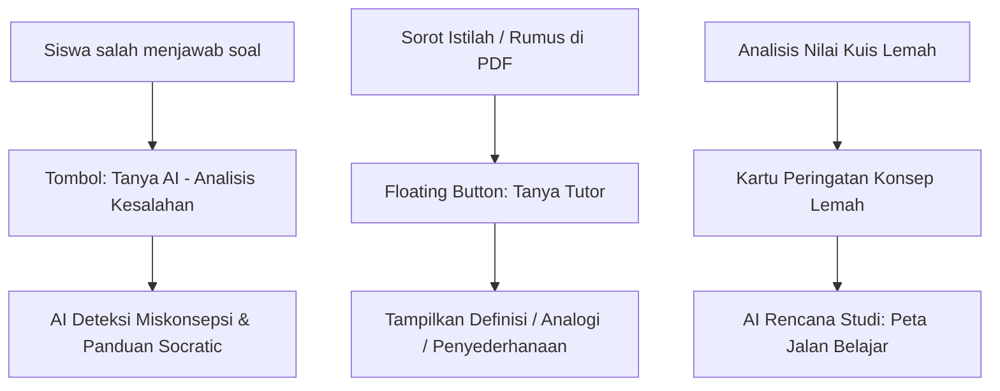

# Rekapitulasi Komprehensif: Seluruh Fitur & Integrasi AI ZYX Academy

Dokumen ini menyajikan rangkuman teknis yang sangat lengkap dan mendalam mengenai seluruh modul pembelajaran, mesin generasi konten, sistem kurasi pengajar, serta integrasi asisten AI yang telah diimplementasikan di ZYX Academy.

---

## 1. Modul Pelajaran & Grafik Pengetahuan (Syllabus & Knowledge Graph)

Modul ini bertanggung jawab untuk memetakan dokumen kurikulum mentah menjadi grafik konsep yang terstruktur dan terindeks dalam database pencarian vektor.

### A. Ingestion Parser (`lib/ingestion-parser.ts`)
- **Fungsi**: Memotong dokumen kurikulum induk (*Master Teaching Document* / MTD) berdasarkan *header* tingkat dua (`## Chapter ...`).
- **Fitur Utama**:
  - Algoritma pemotong berbasis baris (*line-by-line*) untuk mencegah *stack overflow* pada dokumen yang sangat panjang.
  - Pembersihan otomatis spasi kosong dan normalisasi baris baru (`\r\n` ke `\n`).
  - Menghapus teks sampah sebelum bab pertama (seperti judul materi).
  - Skema pembuatan slug URL yang unik: mendeteksi nama bab ganda dan menambahkan akhiran angka secara berurutan (misalnya `rotasi-benda`, `rotasi-benda-1`, `rotasi-benda-2`).

### B. Ekstraksi Knowledge Object / KO (`lib/ko-extractor.ts`)
- **Fungsi**: Mengirimkan bab pelajaran ke Gemini Pro untuk diuraikan menjadi objek-objek pengetahuan mikro (KOs).
- **Klasifikasi Tipe KO**:
  - `definition`: Konsep teoretis atau penjelasan dasar.
  - `formula`: Persamaan matematis fisis beserta unit parameternya.
  - `example`: Soal latihan terstruktur beserta pembahasan lengkapnya.
  - `misconception`: Kesalahan pemikiran klasik beserta pembetulan ilmiahnya.
- **QC & Mekanisme Perbaikan**:
  - Menggunakan validasi JSON Schema ketat via Zod.
  - **Repair Loop**: Jika respons pertama gagal divalidasi oleh Zod, sistem akan mengirimkan pesan kegagalan beserta seluruh isi JSON yang salah kembali ke LLM untuk dikoreksi dalam satu kali putaran perbaikan otomatis (*auto-correction*).

### C. Antrean Sinkronisasi Vektor (`lib/inngest-functions.ts`)
- **Fungsi**: Memastikan setiap pembuatan atau pembaruan KO disinkronisasikan ke Pinecone Index menggunakan pola *Transactional Outbox*.
- **Detail Teknis**:
  - KO disimpan di Postgres, dan dalam transaksi ACID yang sama, sebuah entri antrean dimasukkan ke tabel `vector_sync_queue`.
  - Inngest Background Worker memproses batch antrean, menghasilkan vektor embedding menggunakan model `text-embedding-004` (1024 dimensi).
  - Vektor disimpan di Pinecone dengan mengisolasi namespace per kuliah (`course_{courseId}`) untuk mempercepat pencarian.
  - Status antrean ditandai `completed`. Jika terjadi gangguan server, status diset `failed` dan akan dicoba kembali otomatis (*retry*) hingga 5 kali dengan jeda eksponensial. Panggilan dihentikan permanen jika gagal sebanyak 10 kali untuk diaudit manual.

---

## 2. Pembuat Buku Teks & Editor Pengajar (Website Materials)

Sistem ini mensintesis modul bacaan buku teks fisis dari gabungan objek pengetahuan (KOs) yang tersimpan di PostgreSQL.

### A. Generator Buku Teks (`lib/material-generator.ts`)
- **Fungsi**: Memanggil LLM untuk menggabungkan seluruh KOs aktif menjadi buku teks Markdown yang padat, bergradasi pedagogis, dan dilengkapi target kompetensi (*Learning Objectives*).
- **Fitur Utama**:
  - Menghasilkan markup khusus untuk memetakan KOs (misalnya `:::concept {koId="..."}`).
  - Skema toleransi kegagalan (*model fallback loop*): `gemini-3.5-flash` $\rightarrow$ `gemini-3-flash` $\rightarrow$ `gemini-2.5-flash` untuk menghindari batas penggunaan API.
  - Penyusunan otomatis daftar tujuan pembelajaran (*learning objectives*) di bagian awal bab berdasarkan taksonomi Bloom dari masing-masing KO.

### B. Kompilator & Validasi AST (`lib/markdown-compiler.ts` & `lib/ast-validator.ts`)
- **Fungsi**: Membaca dokumen Markdown pelajaran dan menerjemahkannya menjadi Abstract Syntax Tree (AST) JSON untuk dirender secara dinamis.
- **Aturan Validasi Kualitas (Quality Gates)**:
  - **Validasi Simbol Rumus**: Setiap simbol variabel yang dideklarasikan di tabel parameter rumit (misalnya $\rho, m, V$) harus tertulis secara eksplisit di dalam rumus matematika LaTeX utama ($$\rho = \frac{m}{V}$$).
  - **Pengecekan Soal MCQ**: Pilihan jawaban kuis harus mengandung kunci jawaban yang dideklarasikan.
  - **Penyelarasan Glosarium**: Setiap kata penting yang ditandai dengan kurung siku ganda `[[term]]` wajib memiliki blok definisi kata tersebut di dalam glosarium bab.
  - **Estimasi Waktu Membaca**: Menghitung durasi membaca secara matematis (kecepatan dasar 200 kata/menit, bonus +2 menit per tabel rumus, dan +5 menit per pembahasan soal).

### C. Alur Kerja Revisi & Audit Kadaluwarsa (`lib/material-storage.ts`)
- **Penyimpanan Draft Aman**: Draf yang tidak lolos validasi kompilator AST tetap disimpan ke database sebagai revisi baru untuk mencegah hilangnya pekerjaan pengajar (*data-loss protection*), tetapi statusnya ditandai gagal kompilasi.
- **Penerbitan Ketat**: Pengajar harus mengajukan draf untuk direview. Hanya materi yang lolos kompilasi AST 100% yang dapat diterbitkan (*published*). Saat terbit, KOs aktif di dalam materi langsung dikirim ke antrean sinkronisasi Pinecone.
- **Audit Kadaluwarsa (Staleness Audit)**: Pengajar dapat memicu audit untuk membandingkan hash konten materi dengan hash KOs terbaru di database. Jika ada pengeditan KO secara mandiri, materi terkait otomatis ditandai sebagai `isStale = true` (kadaluwarsa) dan meminta pengajar untuk melakukan regenerasi.

---

## 3. Sistem Flashcard & Pengulangan Berjeda (Spaced Repetition)

Sistem ini membantu hafalan kognitif siswa dengan menghitung waktu belajar yang optimal berdasarkan algoritma SuperMemo-2 (SM-2) yang dimodifikasi.

### A. Algoritma SM-2 Kustom (`lib/flashcard-scheduler.ts`)
- **Fungsi**: Menghitung tingkat kemudahan (*Ease Factor*) dan interval hari belajar berikutnya.
- **Formula SM-2**:
  - $EF' = EF + (0.1 - (5 - q) \cdot (0.08 + (5 - q) \cdot 0.02))$ (di mana $q$ adalah nilai respon siswa 0-5).
  - Interval hari ($I$) dihitung berdasarkan nomor kotak hafalan (*box*):
    - Box 1: 1 hari
    - Box 2: 6 hari
    - Box $\ge$ 3: $I_{n} = I_{n-1} \cdot EF$
- **Fitur Pengaman Kegagalan (Safety Floor)**:
  - Jika kartu yang sudah stabil (interval $\ge 60$ hari) tiba-tiba dijawab salah oleh siswa (skor < 3), kartu dikembalikan ke Box 1, interval direset ke 10 menit, dan sistem menandai bendera `safetyFloorActive = true`.
  - Ketika kartu tersebut berhasil dijawab benar kembali di sesi pemulihan berikutnya, peningkatan interval dibatasi maksimal **14 hari** saja untuk mencegah kartu melompat terlalu cepat sebelum siswa benar-benar ingat kembali.

### B. Evaluator Ujian Mandiri (Decoupled Exam Mode)
- Siswa dapat mengetik jawaban teks secara mandiri.
- Sistem mencocokkan jawaban teks dengan kunci jawaban menggunakan pembersihan string fleksibel (menghilangkan spasi ganda, tanda baca, huruf besar/kecil, dan simbol LaTeX).
- Jika jawaban teks tidak cocok, sistem mencatat kegagalan audit di riwayat, tetapi **tidak memaksa** penurunan nilai SM-2 secara sepihak. Keputusan akhir penilaian tetap diserahkan kepada siswa (*self-grading agency*) untuk melatih kedisiplinan belajar.

---

## 4. Kuis Evaluasi & Validasi Kualitas (Assessment System)

Mesin kuis otomatis yang mampu membuat soal evaluasi kognitif tinggi yang bebas dari miskonsepsi dan didukung verifikasi simbolis.

### A. Blueprint Kognitif (`lib/question-blueprint-engine.ts`)
- **Fungsi**: Memastikan setiap tipe KO melahirkan tipe soal kuis yang tepat secara pedagogis:
  - `definition` $\rightarrow$ Kuis konseptual/analitis (Taksonomi Bloom: *Remember / Understand*).
  - `formula` $\rightarrow$ Soal aplikasi hitungan numerik (Taksonomi Bloom: *Apply / Analyze*).
  - `misconception` $\rightarrow$ Soal jebakan logika pilihan ganda.
- Soal hitungan wajib memiliki struktur distractor (pilihan salah) yang realistis, seperti salah menggunakan tanda positif/negatif atau lupa membagi variabel.

### B. Validasi Kualitas LaTeX Bawaan (`lib/question-validator.ts`)
- **Fungsi**: Menyaring setiap soal yang dihasilkan AI agar bebas dari kesalahan penulisan.
- **Pemeriksaan Ketat**:
  - Pilihan jawaban harus berjumlah tepat 4 opsi.
  - Pilihan jawaban tidak boleh duplikat.
  - Indeks kunci jawaban wajib berada dalam batas jangkauan array pilihan (0-3).
  - **Kompilasi LaTeX Kompatibel**: Setiap persamaan di dalam soal dan pembahasannya diuji langsung menggunakan kompiler KaTeX server-side (`katex.renderToString`). Jika terdapat error penulisan sintaks math ($...$ atau $$...$$), soal ditolak untuk masuk ke bank soal.

### C. Perlindungan Tindih & Batas Batas Generasi (`lib/question-generator.ts`)
- **Overwriting Lock**: Soal berstatus `generated` (hasil AI langsung) akan ditindih/diganti dengan yang baru jika AI dipicu kembali. Namun, jika soal sudah diedit oleh pengajar, statusnya berubah menjadi `reviewed`, mengaktifkan kunci proteksi agar tidak bisa dihapus atau diubah oleh sistem otomatis.
- **Batas Kerapatan Soal (Ceiling Cap)**: Sistem membatasi jumlah maksimal soal aktif per objek pengetahuan (KO) sebanyak **3 soal**. Hal ini dilakukan untuk mencegah penimbunan soal serupa dan menghemat kapasitas database.

---

## 5. Mesin Penyusun PDF Diktat (Diktat PDF System)

Mesin pengumpul materi yang menggabungkan KOs dari beberapa bab pilihan menjadi dokumen ringkasan materi (Diktat) siap cetak.

### A. Penyusunan Konten Diktat (`lib/diktat-generator.ts`)
- **Fungsi**: Membaca grafik bab terpilih, mengumpulkan seluruh KO terkait, dan menyusunnya menjadi format Diktat standar:
  - Daftar Target Kompetensi Bab.
  - Lembar Rumus & Unit Fisika Terpadu.
  - Kumpulan Contoh Soal & Analisis Solusi.
  - Peringatan Miskonsepsi & Kesalahan Perhitungan.
  - Kamus Istilah (Glosarium) Terpadu.

### B. Render Cetak & Puppeteer (`lib/diktat-renderer.ts` & `lib/diktat-actions.ts`)
- **Tata Letak Khusus Cetak**: Dokumen HTML dihiasi dengan CSS print khusus (`@media print`) untuk mencegah baris tabel terpotong di tengah halaman (*page-break avoidance*), otomatis menambahkan nomor urut halaman, serta menyematkan penomoran otomatis untuk setiap baris rumus fisika.
- **Kompilasi Puppeteer**: Server menjalankan peramban Chrome tanpa kepala (*headless Puppeteer*) untuk membuka berkas HTML Diktat, memuat gaya matematika KaTeX secara penuh, mencetaknya menjadi PDF ukuran A4 dengan margin luar 15mm, dan mengunggahnya ke UploadThing CDN.
- **Pembersihan Berkas CDN Obsolete**: Saat asisten meregenerasi Diktat versi baru, sistem secara otomatis mengekstrak kunci berkas lama dari tautan URL lama dan memanggil perintah hapus ke UploadThing CDN agar tidak membuang kuota penyimpanan gratis.

---

## 6. AI Tutor Integrasi Kontekstual (Tutor Interface Layer)

Layanan asisten AI kontekstual yang terintegrasi secara langsung di setiap aktivitas belajar siswa tanpa mengganggu jalannya studi mandiri.

### A. Tinjauan Salah Jawab Kuis (Mistake Review Mode)
- **Kebutuhan**: Siswa sering kali bingung mengapa jawaban mereka salah.
- **Aksi Tutor**: Menganalisis alasan pemilihan opsi salah, mengidentifikasi bias konsep, dan memicu dialog Socratic untuk membimbing siswa menemukan cara pengerjaan yang benar.
- **Pemicu**: Tombol kontekstual pada kuis yang salah di halaman hasil ujian.

### B. Penjelasan Sorotan Buku Teks (Explain Highlight Mode)
- **Kebutuhan**: Menjelaskan istilah akademik yang asing atau rumus fisika yang rumit di tengah-tengah membaca.
- **Aksi Tutor**: Mendeteksi seleksi teks secara instan, menyajikan floating button, memindai KO yang relevan di Postgres secara otomatis, dan menyajikan tiga pilihan bacaan (Definisi asli, Analogi, atau Bahasa Sederhana).

### C. Pemulihan Dashboard (Dashboard Weak Concept Alerts)
- **Kebutuhan**: Mengurangi kebingungan siswa mengenai apa yang harus mereka pelajari selanjutnya saat membuka dashboard.
- **Aksi Tutor**: Menampilkan konsep-konsep bermasalah yang terdeteksi secara otomatis, serta merangkum rencana belajar personal yang berisi rekomendasi materi bab aktif dan kartu hafalan flashcards penunjang.

---

## 7. Kebijakan Retensi Data & Optimalisasi Sumber Dua (PostgreSQL 512 MB & Gemini Free Tier)

Untuk menjaga ketersediaan infrastruktur gratis ZYX Academy dalam jangka panjang, beberapa aturan pembersihan otomatis dan batas kapasitas telah diterapkan:

| Fitur | Jenis Kendala | Mekanisme Kebijakan | Dampak |
|---|---|---|---|
| **Log Aktivitas AI** | Batas ukuran tabel | `UsageBudgetService.pruneOldEvents()` dijalankan berkala untuk menghapus entri log di atas 30 hari. | Tabel `ai_usage_events` terjaga di bawah 1.000 baris. |
| **Token Gemini API** | Batasan Quota (1.500 request/hari, 15 RPM) | 1. Limit kuota harian 30 request per siswa. 2. Mekanisme in-memory cache `explanationCache` untuk data analitis serupa. 3. Skema retry dengan jeda eksponensial di Prompt Executor. | Mencegah overload sistem saat pengerjaan kuis bersama. |
| **Penyimpanan CDN** | Kuota UploadThing (2 GB) | Fungsi `utapi.deleteFiles` secara otomatis menghapus berkas PDF lama saat Diktat diregenerasi. | Menjamin kapasitas penyimpanan gratis tidak pernah penuh oleh sampah revisi lama. |
| **Penyimpanan Snapshot Kuis** | Batas ukuran database Postgres | Menghindari penyimpanan duplikat konten kuis dengan membatasi kerapatan soal maksimal 3 kuis aktif per konsep (KO). | Mencegah pertumbuhan eksponensial tabel kuis. |
| **Grafik Relasi Vektor** | Batas kapasitas Pinecone | Menggunakan namespace khusus `course_{courseId}` sehingga pencarian terarah dan tidak memerlukan resource scan penuh yang mahal. | Mempercepat hasil pencarian hingga < 20ms. |
