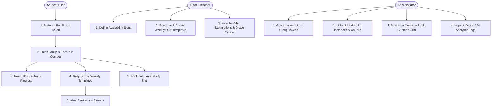

# ZYX Academy Project Architecture & Recap

Welcome to the **ZYX Academy** codebase. This document serves as a complete recap of the project layout, technical system architecture, visual design language, core features, and user workflows. Use this document as a quick-start guide and code preview prior to making any development modifications.

---

## 1. Project Directory Layout

```
zyx-edu/                        # Physical root directory of the ZYX Academy project
├── app/                        # Next.js App Router (Routing and Pages)
│   ├── (auth)/                 # Authentication routes (sign-in, sign-up, sign-out)
│   ├── about/                  # About client pages
│   ├── admin/                  # Administrative tools
│   │   ├── ai/                 # AI Curation & Management Portal
│   │   │   ├── jobs/           # Generation jobs monitor & logs
│   │   │   ├── materials/      # AI Knowledge Material Instance manager
│   │   │   └── questions/      # Question Bank curation grid
│   │   ├── files/              # UploadThing file manager and document node tree
│   │   └── tokens/             # Enrollment token manager
│   ├── api/                    # Backend route handlers (auth, uploadthing, dynamic APIs)
│   │   ├── admin/              # Admin-only endpoints
│   │   │   ├── analytics/      # Question bank, job, and attempt metrics
│   │   │   ├── generation-jobs/# Queue control for AI generation
│   │   │   ├── material-instances/ # Ingest AI Material Instances
│   │   │   └── questions/      # Question bank CRUD and soft retirement
│   │   └── quiz/               # Student quiz APIs
│   │       ├── attempts/       # Quiz attempts start and submit grading
│   │       ├── daily/          # Progress-linked Daily Quiz fetch & submit
│   │       ├── templates/      # Create / list quiz templates
│   │       └── weekly-generate/# Cost-aware Weekly Quiz dynamic generator
│   ├── courses/                # Main student learning section
│   │   └── [id]/               # Specific course portal
│   │       ├── leaderboard/    # Top student score lists
│   │       ├── material/       # PDFs & study notes document viewer
│   │       ├── my-results/     # Submission review & tutor explanations
│   │       ├── quiz/           # Quiz assessment interface
│   │       └── tryout/         # Tryout assessment interface
│   ├── dashboard/              # Student/Tutor main hub & scheduler booking interface
│   │   └── schedule/           # Availability slot allocator & session scheduler
│   ├── feedback/               # Student feedback routing
│   ├── leaderboard/            # Global per-course student leaderboard
│   ├── plans/                  # Subscription levels and pricing packages
│   ├── profile/                # User stats, activities, and profile details
│   ├── globals.css             # Theme definitions, Tailwind directives & CSS variables
│   ├── layout.tsx              # Root HTML wrapper with fonts initialization
│   └── page.tsx                # Marketing landing page with hero, testimonials, and features
├── components/                 # Shared UI & Layout Components
│   ├── admin/                  # Admin-specific UI elements
│   ├── auth/                   # Authentication forms and security widgets
│   ├── course/                 # Course-level widgets and exam interfaces
│   ├── landing/                # Marketing/landing page sections
│   ├── layout/                 # Page layouts (e.g. SectionContainer)
│   ├── ui/                     # Shadcn primitives (button, sheet, table, dialog, input)
│   ├── animated-ornament-canvas.tsx # Three.js custom background canvas
│   ├── student-sidebar.tsx     # Student dashboard side navigation panel
│   └── navbar.tsx              # Global responsive header navigation
├── db/                         # Database Configuration & Schema
│   ├── index.ts                # Drizzle Client initializers
│   ├── schema.ts               # Database tables, enums, indices & relations
│   └── seed.ts                 # Database seeding utilities for mock testing
├── lib/                        # Shared utility libraries (auth wrappers, date helpers, utils)
│   ├── env.ts                  # Injected environment config (Gemini, Pinecone keys)
│   ├── gemini.ts               # Google Gemini client (embeddings & retries helper)
│   ├── ingestion-parser.ts     # Chunk splitter with sliding overlaps
│   ├── pinecone.ts             # Pinecone search and index synchronization engine
│   ├── generation-pipeline.ts  # Asynchronous RAG context generation loop
│   └── monitoring.ts           # Tracing analytics for costs and failure rates
├── types/                      # Common TypeScript interfaces
├── public/                     # Static assets (images, icons, vectors)
├── AGENTS.md                   # Rulebook and constraints for AI Coding Agents
├── ui-visual-style.md          # Visual styling rules and layouts guidelines
└── PROJECT_RECAP.md            # [This File] Codebase preview, rules, features & workflows
```

---

## 2. Technical System Architecture & Stack

- **Framework**: Next.js (v15 App Router). Uses Server Actions for data-modifying mutations and Server Components for page rendering.
- **Database Layer**: Drizzle ORM paired with PostgreSQL (NeonDB).
- **Vector Indexing (New)**: Pinecone Vector Database (Free Tier) with namespace isolation per course.
- **AI Models (New)**: Google Gemini API via `@google/genai` (utilizing `text-embedding-004` for vectors and `gemini-flash` for structured schema assessments).
- **Authentication**: Better Auth (integrated using Drizzle adapters for session and credentials-based auth).
- **Styling Engine**: Tailwind CSS v4 featuring `@theme inline` mapping to semantic CSS variables.
- **File Management**: UploadThing (used for hosting course PDFs and materials under an admin-only drive).
- **Core Interfaces**: Custom-styled Shadcn components utilizing Tailwind utilities.

---

## 3. Style Taste & Design System Rules

These style guidelines must be followed without exception to preserve the premium, minimalist design aesthetics of ZYX Academy:

### 🚫 Pills (Rounded-Full) Constraint
- **No Pill Designs**: Elongated shapes using `rounded-full` (e.g. pill buttons, badges, tag chips, input elements) are **strictly forbidden**. The site owner hates pills.
- **Allowed Border Radii**:
  - Buttons/interactive inputs: `rounded-lg` or `rounded-md`.
  - Badges, tags, and toggles: `rounded-md` or `rounded`.
  - Content containers/panels: `rounded-xl`, `rounded-2xl`, or `rounded-3xl`.
  - **Exception**: Circular elements with a strict 1:1 aspect ratio (such as user avatars, 1:1 circular checkmarks, status indicator dots) are allowed to use `rounded-full`.

### 🚫 Minimizing Card & Box Nesting
- **No Card Slop**: Avoid excessive card containers, nested boxes, or redundant grid cards. 
- **Typography and Dividers First**: Differentiate content and layouts using clean typographic scaling, high-contrast text hierarchy, generous padding, and subtle lines (`border-border`) rather than placing everything inside a card.
- **Required Cards**: When card blocks are necessary, apply the standardized pattern:
  `bg-card border border-border shadow-sm` and appropriate corner rounding (`rounded-xl` or above).

### 🔠 Typography Constraints
- **Brand Headings**: **Lexend** (Google Fonts) mapped to `font-heading`. Utilized for titles `h1`–`h6` with a line-height multiplier of **1.1**.
- **Body & UI Text**: **Inter** (Google Fonts) mapped to `font-sans`. Utilized for paragraphs, input fields, code, tables, and description tags. Line-height multiplier of **1.4**.
- **Paragraph Spacing**: Plain `<p>` gets `text-body-base`. Sequential paragraphs should receive a top margin `p + p` to build a clean reading rhythm.

### 🎨 Color Hierarchy (Adapts to Light/Dark Modes)
- **Semantic Primaries**: Use semantic tokens to handle background swaps (`bg-background` / `text-foreground` and `bg-muted` / `text-muted-foreground`) to maintain dark mode styling automatically.
- **Brand Colors**:
  - Brand Primary Blue: Mapped to `--primary` (`bg-primary`, `text-primary`). Used for core CTA triggers, interactive accents, and brand branding.
  - Brand Secondary Orange: Mapped to `--secondary` (`bg-secondary`, `text-secondary`). Reserved for secondary highlights, badge flags, and warning alerts.
- **No Color Literals**: Never inline arbitrary hex values or Tailwind default color classes (`bg-slate-100`, `text-zinc-800`). Stick strictly to the semantic theme variables.

---

## 4. Key Platform Features

1.  **Student-Tutor Scheduler**: Enables certified tutors (users with role `teacher`) to define weekly availability slots. Students in matching study groups can book one-on-one sessions on a first-come, first-served basis.
2.  **Registration & Activation Tokens**: Tokens generated by admins to activate course access (`ZYX-{unique_8_letters_and_numbers}-{#people}-{#courses}`). Handles group capacity (1 to 5 members).
3.  **Admin File Drive**: Visual explorer for admins. Provides folder tree navigation and uploads syllabus PDFs via UploadThing.
4.  **Learning Assessment Engine**: Integrates short answers, multiple-choice, and essay questions. Essay questions transition to `pending_review` for manual tutor evaluation.
5.  **PDF Material Viewer**: Inline PDF reader allowing students to consume curriculum content and check off completion progress.
6.  **AI-Powered Assessment Ecosystem (New)**: Low-cost engagement daily practice and customizable chapter evaluations.
    *   *Daily Quiz*: Progress-linked, 5-question automated set drawn directly from Postgres via random index sorting. Bypasses Gemini API.
    *   *Weekly / Chapter Quiz*: Tutor-triggered dynamic generation. Retrieval-first RAG searches relevant chunks via Pinecone, queries Gemini to compile a question pool, and allows the tutor to select and approve questions.
7.  **Gamified Leaderboards**: Calculates dynamic averages over quiz attempts and tryouts to rank students.

---

## 5. User Workflows



### 👨‍🎓 Student Lifecycle
1.  **Enrollment**: Redeems token, unlocking courses and joining study groups.
2.  **Study**: Accesses PDFs via document viewer, checking off completion progress.
3.  **AI Assessments**: 
    *   Pulls up Daily Quizzes on dashboard containing questions specifically matching completed material topics.
    *   Takes Weekly or Chapter evaluations published by tutors, locking in randomized question snapshots.
4.  **Scheduler**: Books scheduled slots with certified tutors for personalized consultations.
5.  **Reviewing Outcomes**: Navigates to the results tab to check grading percentages, explanations, and dynamic course leaderboard standings.

### 👩‍🏫 Tutor Lifecycle
1.  **Setting Availability**: Schedules weekly slots for consultations.
2.  **AI Curation**: Triggers weekly quiz templates. Selects questions generated by background RAG queues, reviews accuracy, and publishes them.
3.  **Essay Grading & Remediation**: Evaluates essay submissions and uploads walkthrough reviews.

### 👨‍💼 Administrator Lifecycle
1.  **Token Administration**: Configures capacity access codes.
2.  **Knowledge Sourcing**: Ingests AI Material Instances, parsing them into sections and chunks to coordinate Pinecone embeddings.
3.  **API Curation**: Monitors background job queues, traces token usages, and manages question status states.

---

## 6. AI Assessment Ecosystem Domain & Pipelines

To protect the platform against regression risks, a strict domain separation is maintained:

```
┌──────────────────────────────────────┐     ┌──────────────────────────────────────┐
│  Learning Content Domain (Existing)  │     │       AI Knowledge Domain (New)      │
├──────────────────────────────────────┤     ├──────────────────────────────────────┤
│ • UploadThing Files                  │     │ • AI Material Instances              │
│ • PDF Material Viewer                │     │ • Material Instance Sections (Chunks)│
│ • Student Progress Tracking          │     │ • Vector Embeddings (Pinecone)       │
│ • Course Material Association        │     │ • Centralized Reusable Question Bank │
└──────────────────────────────────────┘     └──────────────────────────────────────┘
```

### A. RAG Ingestion Pipeline
1.  **Ingest Content**: Source files are parsed into logical subsections and chunks (1,000–2,000 characters, 15% overlap).
2.  **Embed Chunks**: Chunks are processed via Gemini's embedding API (`text-embedding-004`).
3.  **Pinecone Index**: Vectors are upserted into Pinecone using course-specific namespaces (`course_{courseId}`).
4.  **Synchronization Engine**: PostgreSQL handles database synchronization (Create ➔ Pinecone Upsert; Update ➔ Pinecone Re-embed; Delete ➔ Pinecone Delete).

### B. Dynamic Question Generation Pipeline
1.  **Tutor Inbound**: Tutor requests a custom topic quiz template.
2.  **Bypass Verification**: If the existing database holds enough questions matching the topic and tags, the template is created instantly, bypassing Gemini to minimize API costs.
3.  **Vector Retrieval**: If question count is low, the topic is converted into a vector query. Pinecone returns Top-K matching chunk IDs.
4.  **Gemini Execution**: Relational chunks are hydrated from PostgreSQL, injected into the system prompt, and passed to Gemini Flash with JSON Schema validation settings to output a pool of $2N$ questions.
5.  **Curation**: Questions are saved to the bank under a five-state lifecycle progression (`generated` ➔ `reviewed` ➔ `published` ➔ `flagged` ➔ `retired`).

### C. Attempt & Attempt Snapshots
To prevent attempts from breaking if questions are edited in the future, the moment a student starts a quiz:
*   The selection rules choose questions matching tags and difficulty proportions (e.g. 3 Easy, 5 Medium, 2 Hard) with low usage counts.
*   The system creates an attempt record and stores a **deep snapshot** containing the complete, raw question content (prompt, options, correct indices, explanation) inside the attempt row, protecting student records against database updates.
