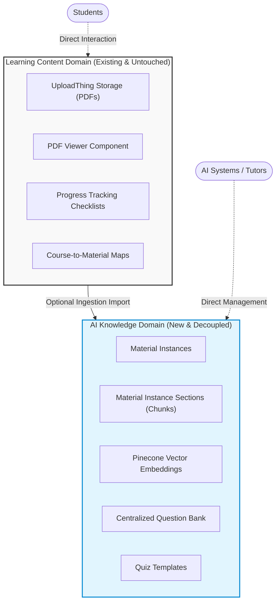
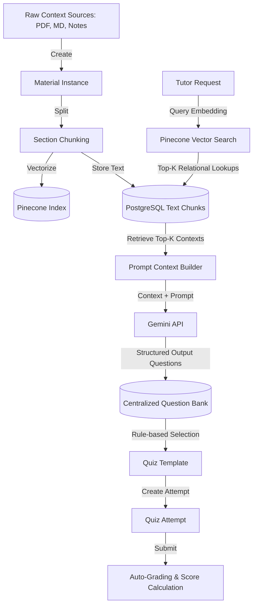
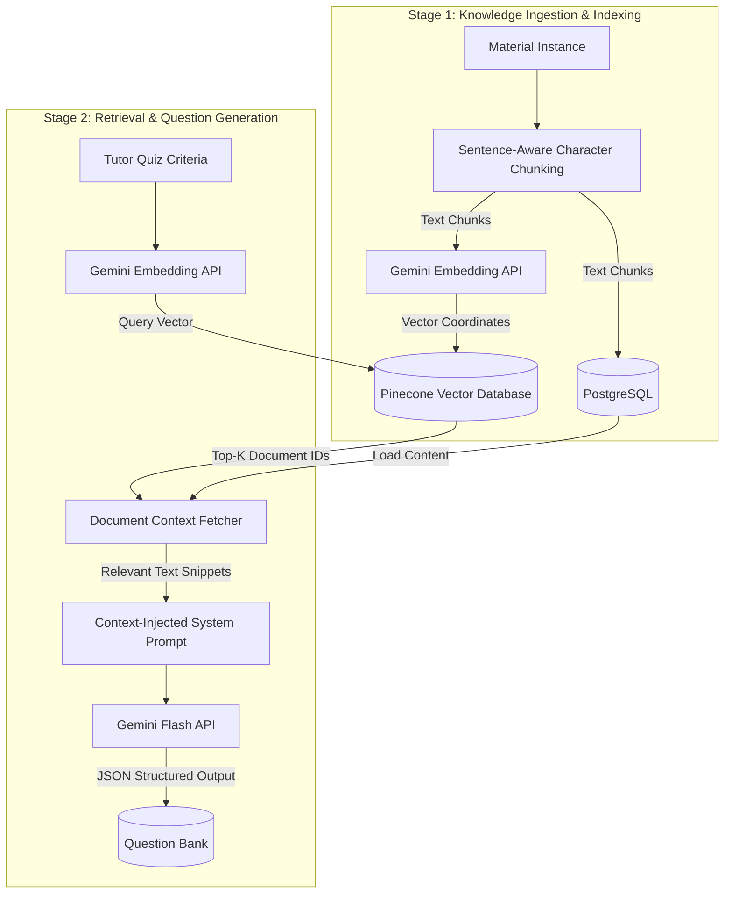

# Architectural Design Document: AI-Powered Assessment Ecosystem
**Target System:** ZYX Academy  
**Author:** Senior Product Architect  

This document outlines the corrected architectural layout for the ZYX Academy AI-powered assessment ecosystem. It establishes a strict separation between student-facing learning content and internal AI knowledge systems, details the Pinecone retrieval pipeline, maps quiz lifecycles, and defines core architectural boundaries.

---

## 1. Domain Separation Diagram

The architecture enforces a strict boundary between the student-facing learning content and the backend AI knowledge structures. The AI domain acts as a non-intrusive extension that consumes learning data only via optional one-way imports.

---

## 2. High-Level System Architecture Diagram

This diagram displays the flow of data through the ingestion, generation, templating, and attempt lifecycles.

---

## 3. Assessment Lifecycle Diagram

This diagram contrasts the low-cost automated Daily Quiz, the curated tutor-triggered Weekly/Chapter Quiz, and high-stakes manually designed Tryouts.

```mermaid
flowchart TD
    %% Daily Quiz
    subgraph DailyQuizFlow ["Daily Quiz (Low-Cost)"]
        LoginTrigger([Student Accesses Dashboard]) --> QBankPull[Query Approved Question Bank]
        QBankPull --> Randomize[Randomly Select 5 Questions]
        Randomize --> DailyAttempt[Generate Attempt Session]
        DailyAttempt --> AutoGrade[On-the-fly Grading]
    end

    %% Weekly / Chapter Quiz
    subgraph WeeklyQuizFlow ["Weekly & Chapter Quiz (Tutor Curation)"]
        TutorTrigger([Tutor Requests Assessment]) --> EmbedQuery[Embed Topic Query]
        EmbedQuery --> PineconeRetrieval[Retrieve Top-K Chunks]
        PineconeRetrieval --> AIGeneration[Gemini Generates Pool Size 2N]
        AIGeneration --> TutorReview[Tutor Reviews, Edits, and Selects N]
        TutorReview --> CreateTemplate[Publish Quiz Template]
        CreateTemplate --> StudentAttempt[Student Creates Attempt]
    end

    %% Tryouts
    subgraph TryoutFlow ["Tryouts (Curated & High-Stakes)"]
        AdminTrigger([Admin Manually Designs Tryout]) --> ReviewLoop[Pedagogical Quality Check]
        ReviewLoop --> PublishTryout[Publish Standard Assessment]
        PublishTryout --> StudentSubmit[Student Submits Tryout Attempt]
        StudentSubmit --> ManualGrading[Optional Manual Essay Grading / Review]
    end
```

---

## 4. AI Knowledge Pipeline Diagram

This diagram outlines the detailed two-stage pipeline for indexing assets and executing retrieval-first generation.

---

## 5. Ownership Boundaries

To ensure clean system operation, the platform maintains clear read, write, and domain boundaries.

*   **Student Learning Materials**: Owned and managed strictly by the learning material system (existing domain). The AI Knowledge Domain has **read-only** entry imports from this system. It cannot write, delete, or alter any student-facing documents.
*   **AI Material Instances**: Owned exclusively by the AI domain. These are raw text, notes, and summarizations optimized for embedding models and prompt insertion. Students have no direct access to this repository.
*   **Centralized Question Bank**: Managed as a permanent business asset. Questions are decoupled from specific exams and templates, belonging directly to the course subject. Write permissions belong to the generation engine (stage 1 validation) and the tutor editing dashboard (stage 2 approval).
*   **Quiz Templates**: Published definitions containing rules (e.g. question pools, difficulties, tags) mapping to Question Bank IDs. 
*   **Quiz Attempts**: Dynamic user session snapshots. Owned by the student taking the quiz. Once created, attempts read from the template to lock in a randomized sequence.

---

## 6. Architectural Principles

*   **Strict Domain Decoupling**: Modifications inside the AI Knowledge Domain must never disrupt or change the schema, logic, or availability of the Student Material Domain.
*   **Retrieval-First Generation (RAG)**: Prompt sizes passed to Gemini are minimized by prioritizing vector retrieval. Raw Material Instances must be chunked and matched via Pinecone rather than passing complete textbooks or files directly into LLMs.
*   **Permanent Question Portability**: Questions must exist independently of attempts, quizzes, or schedules. A question is a reusable asset that tracks its own metadata, statistics, and quality flags over its lifetime.
*   **Quiz Configuration Decoupling**: There is no direct link between the Question Bank and a Student Attempt. The system must route through the `Quiz Template` configuration layer to dictate selection logic and settings.
*   **API Cost Minimization (Daily Quizzes)**: Automated Daily Quizzes must prioritize reusing existing, approved questions in the Question Bank via randomized queries, bypassing Gemini calls completely. The Gemini API is reserved for weekly pool generation or custom requests.
*   **Deferred Caching**: Do not introduce dynamic caching, aggregated leaderboard tables, or query-saving state tables prematurely. The leaderboard must calculate statistics directly from attempt logs to preserve codebase simplicity at early stages.

---

## 7. Scalability Strategy

1.  **Context-Length Control**: Instead of indexing large files as single entities, the chunking pipeline enforces strict segment boundaries (~1,000–2,000 characters). This limits prompt token payloads, decreases generation latency, and minimizes context dilution.
2.  **API Rate Limit Resilience**: Ingestion and weekly question pool generation run asynchronously. Tutors requesting quiz pools are placed in a background execution queue. The user interface updates via status notifications once the AI engine finishes writing the generated pool into the Question Bank.
3.  **On-the-Fly Aggregations**: Leaderboard queries are executed directly on the attempts database using appropriate multi-column indexing. Pre-computed summary databases or write-through memory caches will be introduced only after bottleneck thresholds are crossed in production.
4.  **Vector Filtration**: All Pinecone vector queries must use metadata filters (e.g., matching `course_id`) to drastically limit search spaces, ensuring vector comparisons remain ultra-fast even as the knowledge asset size grows.
