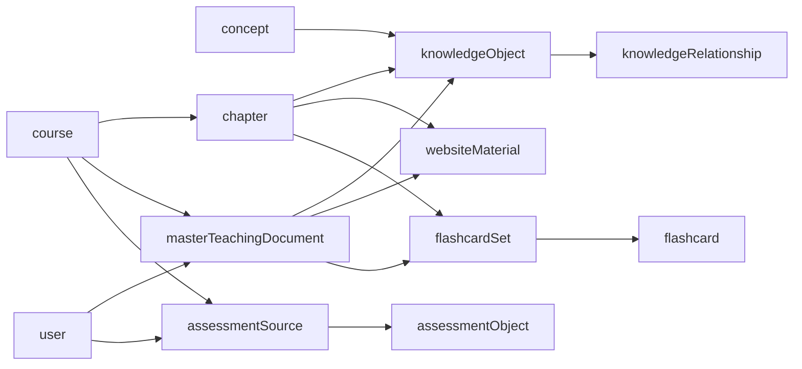

# Bundle V1 — Programmatic Course Import

## Goal

```
bundle.json  ──►  importer.ts  ──►  db.insert()
```

Zero mapping. The JSON shape mirrors the database schema. The importer resolves
references, generates UUIDs, and fills defaults.

---

## 1. Field-Level Schema Analysis (8 Core Tables)

### Legend

| Mark | Meaning | Bundle V1 action |
|------|---------|------------------|
| **R** | Required, no default | MUST appear |
| **D** | Has a schema default | CAN omit |
| **A** | Auto-generated (`defaultNow` / `$onUpdate`) | OMIT |
| **O** | Optional / nullable | CAN omit |
| **FK→** | Foreign key | Importer resolves |

---

### 1.1 `courses`

| Column | | Notes |
|--------|---|-------|
| `id` | **R** | PK — importer generates UUID |
| `title` | **R** | |
| `category` | **R** | Enum: Matematika, Fisika, Kimia, ... (~50 values) |
| `description` | O | |

**FK preconditions**: none (root table)

---

### 1.2 `chapters`

| Column | | Notes |
|--------|---|-------|
| `id` | **R** | PK |
| `courseId` | **R** | FK→`courses.id` — inferred from nesting |
| `title` | **R** | |
| `orderIndex` | **R** | inferred from array index |
| `description` | O | |
| `status` | D | `"draft"` |
| `assetGenStatus` | D | `"idle"` |
| `assetGenFlashcardsTotal` | D | `0` |
| `assetGenFlashcardsCurrent` | D | `0` |
| `assetGenQuestionsTotal` | D | `0` |
| `assetGenQuestionsCurrent` | D | `0` |
| `assetGenError` | O | |
| `createdAt` | A | |
| `updatedAt` | A | |

**FK preconditions**: `courses.id`

---

### 1.3 `concepts`

| Column | | Notes |
|--------|---|-------|
| `id` | **R** | PK |
| `canonicalSlug` | **R** | unique |
| `isVerified` | D | `false` |
| `createdAt` | A | |
| `updatedAt` | A | |

**FK preconditions**: none

---

### 1.4 `knowledgeObjects`

| Column | | Notes |
|--------|---|-------|
| `id` | **R** | PK |
| `courseId` | **R** | FK→`courses.id` — inferred |
| `mtdId` | **R** | FK→`masterTeachingDocuments.id` — importer auto-creates MTD |
| `chapterId` | **R** | FK→`chapters.id` — inferred |
| `conceptId` | **R** | FK→`concepts.id` — resolved via `conceptName` |
| `learningOrder` | **R** | inferred from array index |
| `title` | **R** | |
| `conceptName` | **R** | used to resolve `conceptId` |
| `content` | **R** | Markdown + LaTeX |
| `type` | **R** | `definition` / `formula` / `example` / `misconception` / `exercise` / `summary` / `objective` / `concept_overview` |
| `bloomLevel` | **R** | `remember` / `understand` / `apply` / `analyze` / `evaluate` / `create` |
| `difficulty` | D | `"medium"` |
| `tags` | D | `[]` |
| `importance` | D | `"medium"` |
| `metadata` | D | `{}` |
| `pineconeVectorId` | O | |
| `status` | D | `"active"` |
| `createdAt` | A | |
| `updatedAt` | A | |

**FK preconditions**: `courses.id`, `masterTeachingDocuments.id`, `chapters.id`, `concepts.id`

---

### 1.5 `flashcards`

| Column | | Notes |
|--------|---|-------|
| `id` | **R** | PK |
| `setId` | **R** | FK→`flashcardSets.id` — importer creates set |
| `koId` | O | FK→`knowledgeObjects.id` — resolved or null |
| `front` | **R** | |
| `back` | **R** | |
| `explanation` | O | |
| `status` | D | `"active"` |
| `metadata` | D | `{}` |
| `createdAt` | A | |

**FK preconditions**: `flashcardSets.id` (created on the fly), `knowledgeObjects.id` (optional)

Dependency table `flashcardSets` (not in the 8 but required):

| Column | | Notes |
|--------|---|-------|
| `id` | **R** | PK |
| `courseId` | **R** | FK→`courses.id` — inferred |
| `chapterId` | **R** | FK→`chapters.id` — inferred |
| `sourceMtdId` | **R** | FK→`masterTeachingDocuments.id` — importer creates |
| `sourceMtdVersion` | **R** | default `1` |
| `isStale` | D | `false` |
| `generationHash` | **R** | auto-computed |
| `title` | **R** | |
| `status` | D | `"draft"` |
| `createdAt` | A | |
| `updatedAt` | A | |

---

### 1.6 `assessmentObjects`

| Column | | Notes |
|--------|---|-------|
| `id` | **R** | PK |
| `sourceId` | **R** | FK→`assessmentSources.id` — importer creates source |
| `questionOrder` | **R** | |
| `sourceQuestionNumber` | O | |
| `questionType` | **R** | free text |
| `difficulty` | **R** | integer |
| `applicationLevel` | **R** | integer |
| `pattern` | **R** | free text |
| `reasoningType` | **R** | free text |
| `estimatedSteps` | **R** | integer |
| `questionMarkdown` | D | `""` |
| `answerMarkdown` | O | |
| `options` | O | JSON `string[]` |
| `canonicalQuestionHash` | **R** | auto-computed if omitted |
| `createdAt` | A | |
| `updatedAt` | A | |

**FK preconditions**: `assessmentSources.id`

Dependency table `assessmentSources` (not in the 8 but required):

| Column | | Notes |
|--------|---|-------|
| `id` | **R** | PK |
| `courseId` | **R** | FK→`courses.id` — inferred |
| `title` | **R** | |
| `origin` | D | `"uploaded"` |
| `category` | **R** | `tutorial` / `quiz` / `uts` / `uas` / `tryout` |
| `year` | **R** | |
| `semester` | O | |
| `sourceMarkdown` | **R** | |
| `sourceHash` | **R** | auto-computed if omitted |
| `version` | D | `1` |
| `parserVersion` | D | `"1.0.0"` |
| `ingestionStatus` | D | `"pending"` |
| `ingestionError` | O | |
| `ingestionStartedAt` | O | |
| `ingestionCompletedAt` | O | |
| `originalFilename` | O | |
| `uploadthingKey` | O | |
| `uploadedByUserId` | **R** | resolved from bundle author |
| `deletedAt` | O | |
| `deletedByUserId` | O | |
| `createdAt` | A | |
| `updatedAt` | A | |

---

### 1.7 `websiteMaterials`

| Column | | Notes |
|--------|---|-------|
| `id` | **R** | PK |
| `courseId` | **R** | FK→`courses.id` — inferred |
| `chapterId` | **R** | FK→`chapters.id` — inferred |
| `sourceMtdId` | **R** | FK→`masterTeachingDocuments.id` — importer creates |
| `sourceMtdVersion` | **R** | default `1` |
| `isStale` | D | `false` |
| `generationHash` | **R** | auto-computed |
| `title` | **R** | |
| `slug` | **R** | auto-slugified if omitted |
| `canonicalMarkdown` | **R** | |
| `structuredContent` | **R** | JSON — default `{}` |
| `termIndex` | O | built by post-processing |
| `contentVersion` | D | `1` |
| `status` | D | `"draft"` |
| `coverageStatus` | D | `"not_verified"` |
| `coverageReport` | D | default report object |
| `createdAt` | A | |
| `updatedAt` | A | |

**FK preconditions**: `courses.id`, `chapters.id`, `masterTeachingDocuments.id`

---

### 1.8 `knowledgeRelationships`

| Column | | Notes |
|--------|---|-------|
| `id` | **R** | PK |
| `sourceKoId` | **R** | FK→`knowledgeObjects.id` — resolved |
| `targetKoId` | **R** | FK→`knowledgeObjects.id` — resolved |
| `type` | **R** | `prerequisite` / `related` / `extends` / `example_of` / `misconception_of` |
| `createdAt` | A | |

**FK preconditions**: `knowledgeObjects.id` (both source and target)

---

## 2. Dependency Graph (Insertion Order)



Insertion sequence:

```
 1. course           (root)
 2. concept          (root)
 3. user             (root — resolved by email/name)
 4. masterTeachingDocument  (needs course + user)
 5. chapter          (needs course)
 6. knowledgeObject  (needs course + mtd + chapter + concept)
 7. websiteMaterial  (needs course + chapter + mtd)
 8. flashcardSet     (needs course + chapter + mtd)
 9. flashcard        (needs flashcardSet, optional KO)
10. assessmentSource (needs course + user)
11. assessmentObject (needs assessmentSource)
12. knowledgeRelationship (needs source KO + target KO)
```

---

## 3. Bundle V1 JSON Schema

### 3.1 Format Rules

| Rule | Explanation |
|------|-------------|
| Nested | Chapters inside course, KOs inside chapters, etc. |
| No IDs | Importer generates UUIDs for every row |
| No timestamps | `createdAt` / `updatedAt` are auto |
| No defaults | Anything with a schema default is omitted |
| `$ref` | Cross-entity references use JSON Pointer syntax |
| Positional order | `orderIndex` / `learningOrder` / `questionOrder` derive from array index |

### 3.2 TypeScript Definition

```typescript
interface BundleV1 {
  /** Author resolved by email (lookup or create). */
  author?: {
    email: string;
    name?: string;
  };

  course: {
    title: string;
    category: string;
    description?: string;

    /** Index → orderIndex. */
    chapters: Array<{
      title: string;
      description?: string;

      /** Concepts referenced by KOs in this chapter. */
      concepts?: Array<{
        $id?: string;
        canonicalSlug: string;
        localizations: Array<{
          lang: "id" | "en";
          displayName: string;
          aliases?: string[];
        }>;
      }>;

      /** Index → learningOrder.  concept resolved by matching conceptName. */
      knowledgeObjects?: Array<{
        $id?: string;
        title: string;
        conceptName: string;
        content: string;
        type: "definition" | "formula" | "example" | "misconception"
            | "exercise" | "summary" | "objective" | "concept_overview";
        bloomLevel: "remember" | "understand" | "apply" | "analyze"
                   | "evaluate" | "create";
        difficulty?: "easy" | "medium" | "hard";
        importance?: "high" | "medium" | "low";
        tags?: string[];
      }>;

      /** Zero or one website material per chapter. */
      websiteMaterial?: {
        title: string;
        slug?: string;               // auto-slugified from title
        canonicalMarkdown: string;
        structuredContent?: Record<string, unknown>;  // default {}
      };

      /** Flashcard sets for this chapter. */
      flashcardSets?: Array<{
        $id?: string;
        title: string;
        flashcards: Array<{
          front: string;
          back: string;
          ko$ref?: string;           // $id of a KO in this chapter
          explanation?: string;
        }>;
      }>;
    }>;

    /** Course-level KO-to-KO edges.  Both ends resolved by $id. */
    knowledgeRelationships?: Array<{
      sourceKo$ref: string;
      targetKo$ref: string;
      type: "prerequisite" | "related" | "extends"
          | "example_of" | "misconception_of";
    }>;

    /** Assessment / past-exam sources. */
    assessmentSources?: Array<{
      title: string;
      category: "tutorial" | "quiz" | "uts" | "uas" | "tryout";
      year: number;
      semester?: number;
      sourceMarkdown: string;
      sourceHash?: string;           // auto-computed
      assessmentObjects: Array<{
        questionOrder?: number;      // array index
        questionType: string;
        difficulty: number;
        applicationLevel: number;
        pattern: string;
        reasoningType: string;
        estimatedSteps: number;
        questionMarkdown?: string;   // default ""
        answerMarkdown?: string;
        options?: string[];
        canonicalQuestionHash?: string;  // auto-computed
      }>;
    }>;
  };
}
```

### 3.3 Concrete Example

```json
{
  "author": {
    "email": "admin@zyx.id",
    "name": "System Admin"
  },
  "course": {
    "title": "Kalkulus 1",
    "category": "Matematika",
    "description": "Semester 1 — limit, turunan, integral",
    "chapters": [
      {
        "title": "Limit Fungsi",
        "description": "Definisi limit secara intuitif",
        "concepts": [
          {
            "$id": "c-limit",
            "canonicalSlug": "limit-fungsi",
            "localizations": [
              { "lang": "id", "displayName": "Limit Fungsi" },
              { "lang": "en", "displayName": "Function Limit" }
            ]
          },
          {
            "$id": "c-teorema-limit",
            "canonicalSlug": "teorema-limit",
            "localizations": [
              { "lang": "id", "displayName": "Teorema Limit" }
            ]
          }
        ],
        "knowledgeObjects": [
          {
            "$id": "ko-def-limit",
            "title": "Definisi Limit",
            "conceptName": "Limit Fungsi",
            "content": "Limit $f(x)$ saat $x \\to c$ adalah $L$...",
            "type": "definition",
            "bloomLevel": "understand",
            "difficulty": "easy"
          },
          {
            "$id": "ko-teorema-1",
            "title": "Teorema Limit Utama",
            "conceptName": "Teorema Limit",
            "content": "Jika $\\lim_{x \\to c} f(x) = L$ dan $\\lim_{x \\to c} g(x) = M$...",
            "type": "formula",
            "bloomLevel": "apply",
            "difficulty": "medium"
          }
        ],
        "websiteMaterial": {
          "title": "Limit Fungsi",
          "slug": "limit-fungsi",
          "canonicalMarkdown": "# Limit Fungsi\n\n## Definisi\n\n:::concept {koId=\"...\"}\n...\n:::\n\n## Teorema\n\n:::formula {koId=\"...\"}\n...\n:::"
        },
        "flashcardSets": [
          {
            "title": "Limit — Kartu Hafalan",
            "flashcards": [
              {
                "front": "Apa definisi limit?",
                "back": "Limit f(x) = L ketika x mendekati c",
                "ko$ref": "ko-def-limit"
              },
              {
                "front": "Sebutkan teorema limit utama",
                "back": "lim[f(x) ± g(x)] = lim f(x) ± lim g(x)",
                "ko$ref": "ko-teorema-1"
              }
            ]
          }
        ]
      },
      {
        "title": "Turunan",
        "description": "Konsep dasar turunan",
        "concepts": [
          {
            "$id": "c-turunan",
            "canonicalSlug": "turunan",
            "localizations": [
              { "lang": "id", "displayName": "Turunan" },
              { "lang": "en", "displayName": "Derivative" }
            ]
          }
        ],
        "knowledgeObjects": [
          {
            "$id": "ko-def-turunan",
            "title": "Definisi Turunan",
            "conceptName": "Turunan",
            "content": "$f'(x) = \\lim_{h \\to 0} \\frac{f(x+h) - f(x)}{h}$",
            "type": "definition",
            "bloomLevel": "understand"
          }
        ],
        "websiteMaterial": {
          "title": "Turunan",
          "slug": "turunan",
          "canonicalMarkdown": "# Turunan\n\n## Definisi\n\n:::concept {koId=\"...\"}\n...\n:::"
        }
      }
    ],
    "knowledgeRelationships": [
      {
        "sourceKo$ref": "ko-def-limit",
        "targetKo$ref": "ko-def-turunan",
        "type": "prerequisite"
      },
      {
        "sourceKo$ref": "ko-teorema-1",
        "targetKo$ref": "ko-def-turunan",
        "type": "related"
      }
    ],
    "assessmentSources": [
      {
        "title": "UTS 2026",
        "category": "uts",
        "year": 2026,
        "semester": 1,
        "sourceMarkdown": "---\ncategory: uts\nyear: 2026\nsemester: 1\n---\n## Soal 1\nTentukan limit $x \\to 3$ dari $x^2$.",
        "assessmentObjects": [
          {
            "questionType": "multiple_choice",
            "difficulty": 3,
            "applicationLevel": 2,
            "pattern": "direct_substitution",
            "reasoningType": "analytical",
            "estimatedSteps": 2,
            "options": ["9", "3", "6", "0"]
          }
        ]
      }
    ]
  }
}
```

---

## 4. Importer Responsibilities

| Concern | Strategy |
|---------|----------|
| UUID generation | `crypto.randomUUID()` for every PK |
| FK resolution | Traverse bundle tree; resolve `$ref` by `$id` or by position |
| MTD creation | One `masterTeachingDocument` per chapter (or one shared per course) — auto-generated title + content |
| Slug generation | `title.toLowerCase().replace(/\\s+/g, '-')` |
| Hash generation | SHA-256 of content string |
| Defaults | Omitted fields → schema default (Drizzle handles this) |
| Timestamps | Omitted → Drizzle `defaultNow` |
| Insert order | Follow the 12-step sequence from section 2 |
| Transactions | Wrap all inserts in a single `db.transaction()` — rollback on failure |
| Dry run | `--dry-run` flag: validate bundle + report what would be inserted, no DB writes |

---

## 5. What the Bundle Author Writes vs. What the Importer Supplies

| Role | Author writes | Importer supplies |
|------|---------------|-------------------|
| Content | Titles, markdown, questions, flashcard front/back | — |
| Structure | Nesting (chapters → KOs → materials) | — |
| IDs | Only `$id` markers for cross-references | Real UUIDs |
| Timestamps | Nothing | `defaultNow` |
| Status flags | Nothing | Schema defaults |
| FKs | Only `$ref` strings | Resolved UUIDs |
| Hashes | `sourceHash` / `canonicalQuestionHash` optional | Auto-computed |
| MTD records | Nothing | Auto-created per chapter |
| Flashcard sets | Nothing | Auto-created per set group |
| Assessment sources | Nothing | Auto-created per source entry |
| Slug | `slug` optional | Auto-slugified |
| `generationHash` | Nothing | Auto-computed |
| `structuredContent` | Optional `{}` | Passed through as-is |

---

## 6. Edge Cases

| Situation | Handling |
|-----------|----------|
| KO references concept that doesn't exist | Fail validation with `conceptName` + available concepts |
| Duplicate `$id` | Fail validation |
| Cyclic `knowledgeRelationships` | Allowed (graph supports cycles) |
| Empty `chapters` array | Allowed (course shell with no content) |
| Assessment source with zero questions | Allowed (placeholder source) |
| Chapter with no KOs | Allowed; websiteMaterial and flashcards still valid |
| Flashcard references nonexistent KO `$ref` | Fail validation |
| Multiple chapters with same title | Allowed (distinguished by index) |
