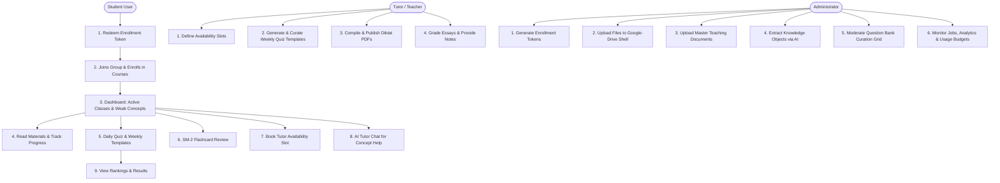

# ZYX Academy Features & Workflows Guide

Welcome to ZYX Academy! This guide is designed for newcomers, content creators, administrators, and developers. It provides a detailed, straightforward overview of how the platform operates, how different users interact with it, and how the underlying automated systems work; even if you have no access to the codebase or prior knowledge of the project.

---

## 1. What is ZYX Academy?

ZYX Academy is a premium, AI-powered learning management and tutoring platform. It is designed to bridge the gap between static educational content and personalized learning. 

At its core, ZYX Academy takes authoritative teaching documents (curated by experts), breaks them down into atomic concepts, and uses this structured knowledge to power:
1. **Personalized Learning Paths & Recommendations** for students.
2. **Interactive Study Materials & PDF Guides (Diktats)**.
3. **An Adaptive Flashcard System** using spaced-repetition science.
4. **AI-Driven Assessments & Chat Tutoring** with strict cost controls.
5. **One-on-One Tutor Scheduling** and live synchronous classroom quizzes.

---

## 2. Platform User Roles

The system is built around three distinct user roles, each having a unique workflow:

### A. The Student (Learner)
* **Goal:** Master the course material, review weak areas, practice with quizzes, and get help when stuck.
* **Key Interactions:**
 * Redeems enrollment tokens to gain access to courses.
 * Views progress, active courses, and personalized daily recommendations on their Dashboard.
 * Learns via the **Material Viewer** (reading markdown texts, viewing videos/images, or reading PDFs).
 * Takes **Daily Quizzes**, **Weekly Quizzes**, and timed **Tryouts**.
 * Reviews flashcards via the **SM-2 Spaced Repetition** engine.
 * Chat-chats with the **AI Tutor Drawer** to resolve questions about concepts or quiz mistakes.
 * Books real-life tutoring sessions with available teachers.
 * Participates in **Live Classrooms** hosted by teachers.

### B. The Tutor / Teacher (Subject Expert)
* **Goal:** Manage availability, evaluate student submissions, curate test questions, and compile study guides.
* **Key Interactions:**
 * Lists weekly time slots for student consultations.
 * Triggers weekly quiz generation templates and moderates AI-generated questions before publishing them.
 * Grades essay questions, inputs feedback, and records video/text explanations.
 * Compiles course chapters into structured study guides (**Diktats**), applying manual overrides to formulas or concept blocks.
 * Hosts synchronous **Live Quiz Sessions** in the classroom.

### C. The Administrator (Operations & Content)
* **Goal:** Set up courses, manage raw file assets, run the AI ingestion pipelines, and control licenses.
* **Key Interactions:**
 * Generates multi-user group enrollment tokens.
 * Organizes files and folder structures in the **Admin File Drive** (Google Drive-style explorer).
 * Uploads source **Master Teaching Documents (MTDs)**.
 * Runs the **AI Extraction Pipeline** to decompose documents into structured **Knowledge Objects (KOs)**.
 * Curates the global **Question Bank** using a five-state moderation grid.
 * Configures quiz templates, selection rules, and monitors background sync queues/analytics.

---

## 3. Core Workflows & Lifecycles

Here is how the workflows flow visually and sequentially:

### 👨‍🎓 3.1 Student Lifecycle
1. **Activation:** The student starts by inputting a token (e.g., `ZYX-ABCD1234`) on their dashboard. This automatically links them to a study group and enrolls them in designated courses.
2. **Learning Loop:** 
 * The student views the **Dashboard** which highlights active courses, a visual progress bar, in-progress documents, and a list of **Weak Concepts** calculated automatically based on past quiz attempts.
 * They access course materials. The **Material Viewer** natively handles PDFs, Markdown articles, images, and embedded YouTube/R2 videos.
3. **Daily Practice:** Every day, the student is presented with a **Daily Recommendation** and a **Daily Quiz** (5 questions). The quiz is drawn dynamically from completed topics without calling AI models (saving quota).
4. **Spaced Repetition:** The student opens their Flashcards tab. The system tells them exactly which cards are due for review. They type answers or self-grade, and the system schedules the next review date.
5. **Human & AI Support:** If stuck, the student opens the **AI Tutor Drawer** to chat about the page they are on. If they need human intervention, they book a slot with their designated course tutor.
6. **Performance Review:** They check the leaderboard to see their rank (calculated as: `quiz_average + 2 × tryout_average`) and click into completed submissions to view question-by-question answer keys, teacher notes, and feedback.

### 👩‍🏫 3.2 Tutor Lifecycle
1. **Availability Allocation:** Tutors set up recurring slots (e.g., Monday 9:00 - 10:30). Students book these slots first-come-first-served.
2. **Quiz Management:** Instead of writing quizzes from scratch, a tutor triggers a quiz generation. The background AI pulls course concepts, creates a question pool, and the tutor selects, edits, and publishes the best ones.
3. **Diktat Compilation:** A tutor selects chapters (e.g., "Calculus Chapter 1 & 2"), sets specific formatting/formula overrides, and triggers a Diktat compilation. The system builds a unified, printable PDF textbook.
4. **Essay Review:** For essay assessments, the tutor receives submissions flagged as `pending_review`. They enter grades, type feedback, or link video explanations.

### 👨‍💼 3.3 Admin Lifecycle
1. **Access Provisioning:** The admin configures enrollment tokens, setting an expiration date, course packages, and maximum capacity (1 to 5 seats, perfect for student study groups).
2. **Document Management:** The admin uploads textbooks and syllabus files into a nested folder tree (Google Drive style).
3. **Knowledge Ingestion (Crucial Pipeline):** The admin uploads a **Master Teaching Document (MTD)**. They click "Extract KOs," launching an AI model that decomposes the textbook into structured concepts.
4. **Question Bank Curation:** The admin reviews questions generated by AI, marking them as `reviewed`, `published` (available for quizzes), or `retired`.
5. **System Governance:** The admin monitors background vector queues, monitors user AI usage, and manages billing models.

---

## 4. Key Features & Automated Pipelines

Under the hood, ZYX Academy relies on automated pipelines to handle content, vectors, spaced repetition, and compilation. Here is how they function:

### 📄 A. The Master Teaching Document (MTD) to Knowledge Object (KO) Pipeline
To make textbooks interactive, they must be broken into structured fragments.
1. **Markdown Upload:** The admin uploads an MTD (a markdown file).
2. **Atomic Deconstruction (AI):** An AI model reads the text and decomposes it into **Knowledge Objects (KOs)**. Each KO represents a single definition, formula, misconception, example, or exercise.
3. **Metadata Enrichment:** Each KO is automatically tagged with:
 * **Bloom's Taxonomy Level:** (e.g., *Remember*, *Understand*, *Apply*, *Analyze*).
 * **Difficulty:** (Easy, Medium, Hard).
 * **Type:** (Formula, Definition, Example, etc.).
 * **LaTeX Math Formulas:** Standardized formatting using `$` (inline) and `$$` (block).
4. **Pinecone Vector Database Sync:** To allow search and RAG retrieval, a background job runs every 5 minutes. It takes new KOs, translates them into mathematical embeddings (vectors), and uploads them to a vector index isolated by course (`course_{courseId}`).

### 🌐 B. Website Material Generation
How do students read textbook chapters on the website?
1. The system collects all KOs associated with a chapter in order.
2. An AI model compiles these KOs into clean, readable Markdown using **custom container blocks** (e.g., `:::concept`, `:::formula`, `:::misconception`).
3. A custom compiler parses this file into a structured tree (AST) and renders it as an interactive web page.
4. **Formula Extraction:** The compiler extracts mathematical equations and builds interactive parameter sheets (showing symbols, names, and units) automatically.
5. **Reading Time Estimation:** The system calculates reading time based on a formula weighing words, formula complexity, and example steps:
 $$\text{Reading Time (min)} = \lceil \frac{\text{Word Count}}{200} + (\text{Formula Count} \times 2) + (\text{Example Step Count} \times 5) \rceil$$

### 🗂️ C. Flashcards & SM-2 Spaced Repetition Engine
Flashcard sets are automatically generated from KOs. The system schedules reviews using a modified version of the **SuperMemo-2 (SM-2)** algorithm to optimize memory retention:
* **Recall Grades:** When reviewing a card, students select their recall quality:
 * `1` (Again - completely forgot)
 * `2` (Hard - remembered with high effort)
 * `3` (Good - remembered with normal effort)
 * `4` (Easy - remembered immediately)
* **Ease Factor (EF) Adjustment:** The difficulty level of the card adapts:
 * Grade 1: decreases EF heavily (makes it reappear sooner).
 * Grade 4: increases EF (pushes it further into the future).
* **Interval Spacing ($I$):** The number of days before a card is due:
 * Box 1 (1st correct recall): 1 or 2 days.
 * Box 2 (2nd correct recall): 3 to 8 days.
 * Box 3+: Prior interval multiplied by the card's Ease Factor.
* **Safety Floor Recovery:** If a student forgets a highly stable card (one they haven't seen in over 2 months), it resets. However, once they get it right again, the system caps the recovery interval to a maximum of 14 days rather than jumping back to a 2-month delay, protecting the student from forgetting it again.
* **Exam Mode Grader:** When typing answers, a normalizer strips capitalization, spaces, and punctuation to evaluate correctness leniently (e.g. if the answer is "Force = Mass * Acceleration", typing "force = mass * acceleration" passes).

### 📕 D. Diktat PDF Compilation
Tutors can generate printable PDF textbooks.
1. The tutor selects course chapters.
2. The system fetches the corresponding KOs and formats them into a structured JSON configuration.
3. The tutor can insert overrides (e.g. replacing a complex formula with a simplified note).
4. The system renders the document into HTML (with tables, formatting, and mathematical equations rendered via KaTeX).
5. A background Puppeteer browser compiles the HTML into an A4 PDF and uploads it to Cloudflare R2 storage, returning a fast, downloadable CDN link.

### 🛡️ E. AI Quota Guard & Money Rules
AI queries cost money. The platform implements a strict **AI Quota Philosophy**:
* **Deterministic Calculations:** Engagement metrics like streaks, daily quiz selectors, cohort analytics, study paths, and reflections do **NOT** use AI. They are computed mathematically via SQL databases.
* **AI Allocation:** AI models are reserved exclusively for three tasks:
 1. The Tutor Drawer chat.
 2. Question/Flashcard generation.
 3. Generating feedback for quiz mistakes.
* **Daily Cap:** Students are limited to **30 AI requests per day** to protect resources.
* **KV Write Guard:** Cloudflare Workers database writes are capped. A counter stops new database writes if they exceed 900 in a single day, while reads remain active.

---

## 5. Billing & Pricing Calculator
The system features a dynamic group-pricing calculator. Costs scale non-linearly using power-law formulas so that groups and multiple courses receive bulk discounts:
* **Platform Subscription Cost:**
 $$\text{Cost} = 1000 \times \text{round5}(\text{base} \times \text{courses}^{0.55} \times \text{persons}^{0.85})$$
* **Tutorial Session Cost:**
 $$\text{Cost} = \text{sessions} \times 1000 \times \text{round5}(\text{base} \times \text{persons}^{0.44})$$

This model supports five pricing tiers (**Free**, **Minimal**, **Essential**, **Premium**, and **Custom**), displayed natively in Indonesian Rupiah (IDR), with direct redirection to WhatsApp chats containing pre-filled booking details.
